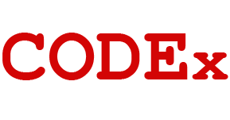

## 
Value Proposition Statement 

 

**Bootcamp CODEx** is a powerful, flexible, and highly scalable tool that can be used to retrieve and filter learning and networking content specifically geared toward bootcamp students and curricula.
 
 

---
 
While coding bootcamp’s are built to serve those with little to no knowledge of web development or the attendant industry, on their very premise these bootcamps are not meant to fully meet the learning needs of their students. It then falls to the students -those least suited to the task- to augment their coding and career education by sifting through the massive and often confusing cornucopia of online resources for coding tutorials and networking opportunities. **Bootcamp CODEx** , developed by some of those very same students, seeks to streamline that process by serving tailored and proportional resources and content based on customizable parameters set by the requester.
 
 

---
 

## Features:
* Search parameters, subjects, resources and content as specified by either the bootcamp student or curriculum provider.
* Infinite and OpenSource scalability through a flexible API, friendly back-end, and responsive front-end.
* Easily developable framework for future app integrations and cross-platform communications.
